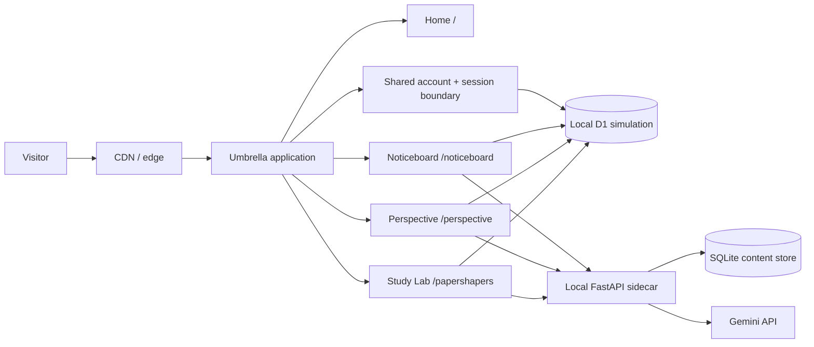
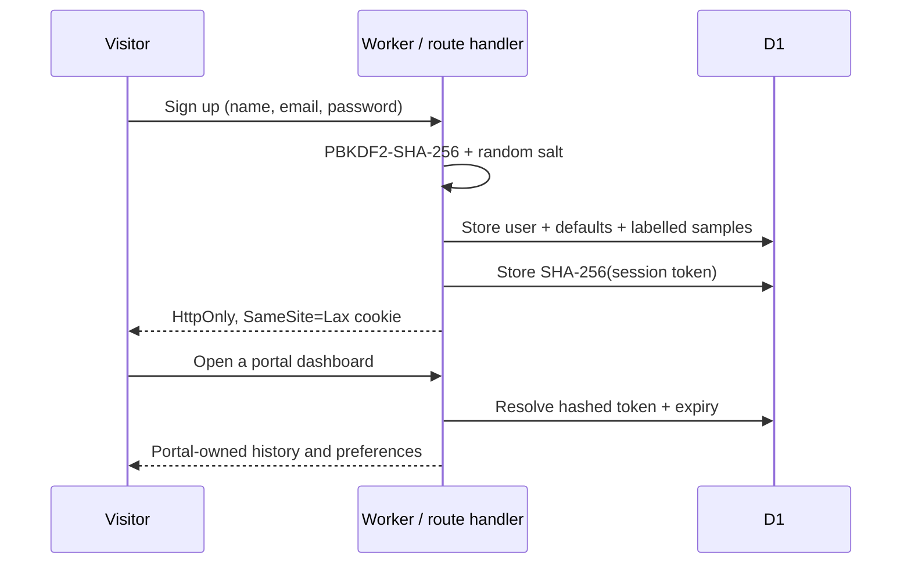
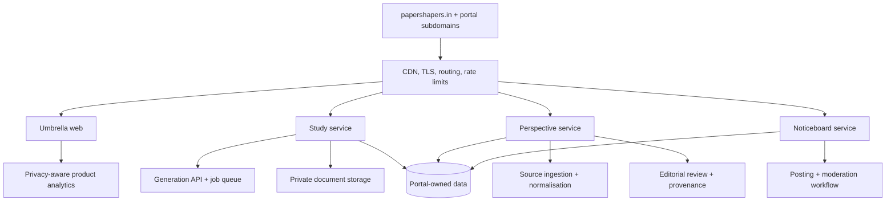

# Paper Shapers system design

## Objective

Build a recognisable umbrella brand that can launch several focused services cheaply, validate them independently, and extract successful products into subdomains or separate deployments without a front-end rewrite.

## Current system (phase 1)

The web application is a single vinext deployment. Pages render on the server; only focused controls hydrate in the browser. D1 stores accounts, sessions, user-visible study history, saved items, and cold-start preferences. A replaceable FastAPI sidecar owns generated content, news ingestion/analysis, and the marketplace catalogue in local SQLite. Same-origin web API routes enforce identity and shield model credentials.

## Identity and access

Study requires authentication before creating a brief. Perspective and Nearby remain readable without an account; saving, personalisation, and posting require one. A shared `.papershapers.in` cookie supports all three custom subdomains.

## Target system (phases 2–3)

Suggested domain map:

| Surface | Phase 1 | Future subdomain |
| --- | --- | --- |
| Umbrella | `/` | `papershapers.in` |
| Study Lab | `/papershapers` | `learn.papershapers.in` |
| Perspective | `/perspective` | `news.papershapers.in` |
| Noticeboard | `/noticeboard` | `nearby.papershapers.in` |

The single Worker is attached to every hostname. It internally rewrites `/` and `/dashboard` to the corresponding portal route; it does not send an HTTP redirect, so the public URL remains the subdomain. Extraction should happen only when a portal needs a distinct backend, security boundary, team, or release cadence.

## Current data model

| Table | Ownership and purpose |
| --- | --- |
| `users` | Shared identity only; unique email and salted password derivative |
| `sessions` | Shared hashed opaque sessions with a 30-day expiry |
| `study_requests` | Study-owned request/history records, including labelled demo rows |
| `user_preferences` | Per-portal news topics, marketplace interests, and coarse area |
| `saved_items` | Portal-scoped saved news and marketplace items |
| `generated_paper_cache` | Study-only, expiry-bound identity-free validated paper content; recovery-only, never attempts or learner records |
| `paper_feedback` | Study-owned, owner-scoped category/comment signal for human review; excluded from live prompts and learner scoring |
| `contact_submissions` | Public Study contact/feedback notes with minimal reply context; separate from learner papers and never published as testimonials without permission |

Portal queries always include `user_id` and, for shared storage, a portal discriminator. Future services should receive the stable user ID through a signed identity contract rather than query shared credentials.

Public contact submission is the exception: it does not require an account, accepts a short validated message, and stores only the contact details supplied for a reply. It is deliberately separate from student answers, attempts, and model prompts.

## Portal boundaries

- **Study Lab:** curricula, practice configuration, uploads, generation jobs, answer keys, saved work.
- **Perspective:** sources, claims, viewpoint analysis, editorial decisions, corrections, publication history.
- **Noticeboard:** places, geographic cells, posts, expiry, verification, reports, moderation.
- **Umbrella:** discovery, shared brand, cross-navigation, legal pages, and aggregate status only.

Each portal owns its data. The umbrella may consume a small public catalogue API later, but it must not query portal tables directly.

## Key backend flows

### Provider routing

The Study router uses an explicitly configured ordered sequence of Gemini, Groq, and NVIDIA NIM. Each provider owns a local key ring: a request rotates its starting slot and only tries remaining slots after a failure, then proceeds to the next configured provider. It is deterministic routing, not an agent. Every provider receives the same source-bounded request and must return valid JSON that survives the Study schema/mark validation; invalid output is a provider failure and is never saved. A deterministic mock is available only when explicitly enabled for tests. A fresh run fails closed instead of saving template content. After a successful real run, the backend stores an identity-free, expiry-bound cache entry keyed by the canonical paper brief and prompt/source version. It creates a private copy from that cache only after every real provider fails; attempts and learner data are never shared. Provider failures are summarized internally and never expose keys or upstream response bodies.

### Study generation

1. Validate curriculum, class, chapter, intent, and limits.
2. The prototype generates synchronously; before production, replace this with an idempotent queued job so request workers do not remain open for model work.
3. Retrieve approved curriculum context and, when authorised, user documents.
4. Generate structured questions and answers, then validate schema and safety.
5. Persist the result and notify the client by polling or server events.
6. Expire private uploads on a documented schedule.

### Study paper lifecycle (current prototype)

1. A signed-in learner creates a half or full paper from the Study landing route.
   The dedicated planner reads the supplied local Paper Shapers chapter-content source and validates the selected Class 9–12 subject and chapters against it.
2. The backend saves an owner-scoped structured paper and the browser navigates to a dedicated reader route.
3. The learner opens a distraction-free attempt route and submits responses.
4. The backend stores an owner-scoped attempt and returns formative per-question feedback, including the source question and submitted answer alongside marks and the answer outline.
5. The result is visible on its own route and the dashboard lists generated papers for later attempts.

The generated-paper reader also supports the browser's native print/save-to-PDF path and optional owner-scoped feedback. A rule-based Study Guide routes common learner and educator needs to existing flows and FAQs. It does not act as an LLM agent, answer arbitrary homework questions, or send free-form support input to a model. Feedback remains out of live prompts until an authorised human review process and evaluation plan exist.

Scores are explicitly practice estimates. They must not be represented as official marks or used for high-stakes learner decisions without validated rubrics and educator oversight.

The UI shows a paper-derived timer and locally autosaves unsubmitted draft answers on that device. Before display, a model-assisted result must match the generated question IDs, use numeric marks, and stay within each question's mark cap; a failed check falls back to the local practice rubric. Both paths keep the generated question and learner response in the stored review record, so the client never has to recreate result context. This is schema validation, not independent verification that an academic answer is correct.

### Perspective publishing

1. Ingest licensed feeds and primary sources; preserve canonical URLs and timestamps.
2. Cluster reporting about the same event.
3. Extract claims separately from commentary.
4. Produce viewpoint drafts with source-level citations and uncertainty markers.
5. Require human editorial approval for publication and corrections.
6. Publish a versioned article; never silently rewrite an earlier analysis.

### Noticeboard posting

1. Establish approximate area with explicit visitor choice; precise location is optional.
2. Verify business contact or community identity before high-volume posting.
3. Store a structured post with category, area, start/end time, and expiry.
4. Run automated risk checks, then route reports and uncertain cases to moderation.
5. Rank primarily by distance, freshness, and relevance—not paid engagement.

## Security and trust controls

- Rate-limit generation, authentication, publishing, and reporting separately.
- Use short-lived signed upload URLs; scan documents before processing.
- Isolate uploaded content from prompts and treat it as untrusted data.
- Keep immutable provenance for news sources and editorial changes.
- Minimise location precision and never expose a private user's exact coordinates.
- Expire noticeboard posts by default and record moderation actions.
- Add consent-aware analytics; avoid cross-portal behavioural profiles.
- Store secrets only in the hosting platform, never in client bundles or the repository.
- Do not enable an advertising provider until its publisher identifier, privacy disclosures, consent flow where required, and content review are in place. Student answers and attempts must not be advertising-targeting signals.
- Do not import legacy source-research helpers that embed provider credentials or discard source provenance. Research features must retain dated citations and a reviewer boundary.

## Deployment strategy

The selected web/identity baseline is Cloudflare Workers + D1. The Python content sidecar can remain local during development and later run on a container-capable host. Set `BACKEND_ORIGIN` only on the Worker and use a shared service secret; do not expose provider keys to browser code. SQLite is suitable for the local single process, but a multi-instance deployment must use managed shared storage. Netlify or Firebase would require adapting the Worker/D1 identity boundary. No local command publishes by accident.

Recommended rollout:

1. Ship this public prototype and collect task-level feedback.
2. Validate the connected vertical slice now present in each portal.
3. Add approved source/curriculum data, job queues, and portal moderation as usage proves the need.
4. Introduce subdomain aliases, then separate deployments when operational needs diverge.

## Quality gates

- Production build and structural tests pass.
- No starter metadata or prototype-only dependencies remain.
- Critical interactions work with keyboard and touch.
- Layout is reviewed at approximately 390 px, 768 px, and 1440 px.
- Demo content is visibly described as illustrative.
- The relevant README and this design document reflect every architecture change.

The shared and portal-specific interaction rules are maintained in [UI_UX_GUIDE.md](UI_UX_GUIDE.md). Operational commands and the local-to-hosted handoff are maintained in [../RUNBOOK.md](../RUNBOOK.md).
