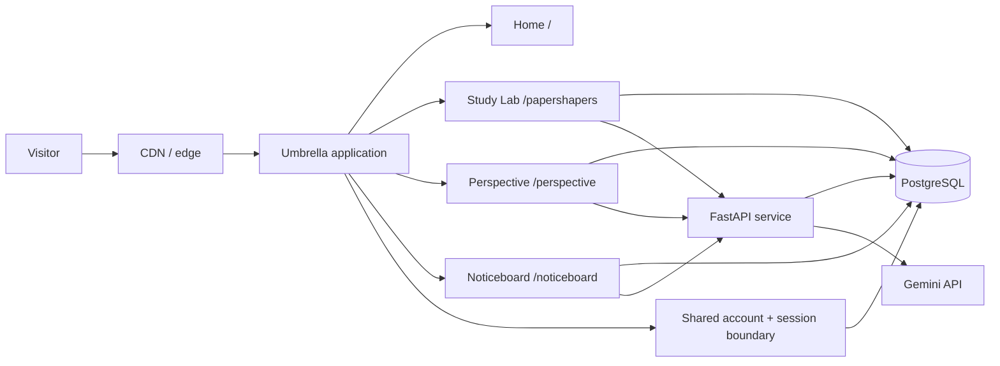
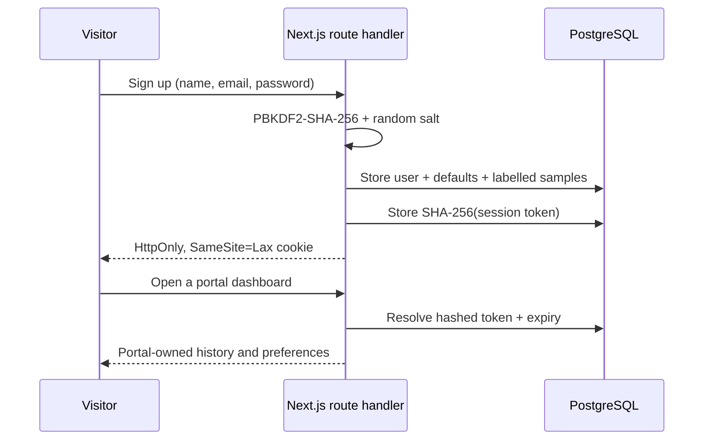
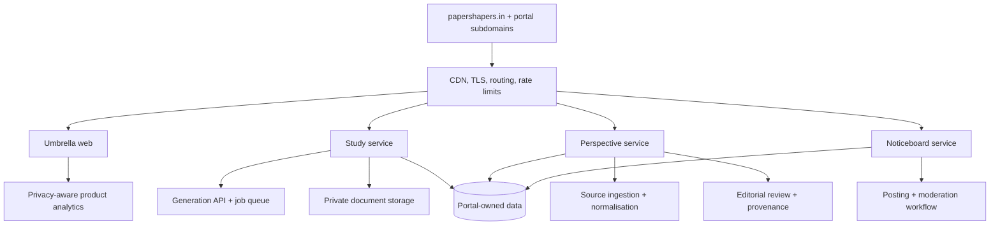

# Paper Shapers system design

## Objective

Build a recognisable umbrella brand that can launch several focused services cheaply, validate them independently, and extract successful products into subdomains or separate deployments without a front-end rewrite.

## Current system (phase 1)

The web application is a standard Next.js deployment. Pages render on the server; only focused controls hydrate in the browser. PostgreSQL stores accounts, sessions, user-visible history, generated content, attempts, rooms, and preferences. Netlify and Render use separate least-privilege roles against one migrated schema; FastAPI owns generated content and model calls. Same-origin web API routes enforce identity and shield model credentials. Private Study pages redirect anonymous visitors to sign-in; the corresponding web APIs return `401` without a valid session, and FastAPI rejects private routes unless its server-to-server shared secret is configured and supplied.

## Identity and access

Study requires authentication before creating a brief. Perspective and Nearby remain readable without an account; saving, personalisation, and posting require one. A shared `.papershapers.in` cookie supports all three custom subdomains.

## Target system (phases 2–3)

Suggested domain map:

| Surface | Phase 1 | Future subdomain |
| --- | --- | --- |
| Umbrella | `/` | `papershapers.in` |
| Study Lab | `/papershapers` | `learn.papershapers.in` |
| Perspective | `/perspective` | `news.papershapers.in` |
| Noticeboard | `/noticeboard` | `nearby.papershapers.in` |

The single Worker is attached to every hostname. It internally rewrites `/` and `/dashboard` to the corresponding portal route; it does not send an HTTP redirect, so the public URL remains the subdomain. Extraction should happen only when a portal needs a distinct backend, security boundary, team, or release cadence.

## Current data model

| Table | Ownership and purpose |
| --- | --- |
| `users` | Shared identity only; unique email and salted password derivative |
| `sessions` | Shared hashed opaque sessions with a 30-day expiry |
| `study_requests` | Study-owned request/history records, including labelled demo rows and a nullable paper ID linking new briefs to the corresponding private generated paper |
| `user_preferences` | Per-portal news topics, marketplace interests, and coarse area |
| `saved_items` | Portal-scoped saved news and marketplace items |
| `generated_paper_cache` | Study-only, expiry-bound identity-free validated paper content; recovery-only, never attempts or learner records |
| `paper_feedback` | Study-owned, owner-scoped category/comment signal for human review; excluded from live prompts and learner scoring |
| `contact_submissions` | Public Study contact/feedback notes with minimal reply context; separate from learner papers and never published as testimonials without permission |
| `community_posts` | Study Journal editorial guides and signed-in user submissions. User submissions begin `pending`; only explicitly reviewed `published` entries are visible publicly. |
| `test_rooms` | Study-owned educator live test rooms linked to a teacher ID and paper ID, with session status (`waiting`, `active`, `completed`). |
| `test_attendees` | Student participants in a live test room with name, roll number, status (`joined`, `completed`), JSON-serialized question responses, and score. Cascades on room deletion. |

Portal queries always include `user_id` and, for shared storage, a portal discriminator. Future services should receive the stable user ID through a signed identity contract rather than query shared credentials.

Public contact submission is the exception: it does not require an account, accepts a short validated message, and stores only the contact details supplied for a reply. It is deliberately separate from student answers, attempts, and model prompts.

The Study Journal is a deliberately small moderation boundary rather than an unbounded forum: a signed-in learner may submit a title, summary, and note; the write route records it as `pending`; public pages query only `published` entries. There is no direct-message, comments, upload, public profile, answer-sharing, or automatic publishing capability. Paper Shapers starter guides are marked as editorial content rather than user activity.

Teacher Live Rooms provide a lightweight, friction-free session boundary: hosting requires an authenticated teacher account, whereas student attendees join using only their name and roll number. Access is managed via scoped HTTP-only session cookies (`attendeeId_{roomId}`) to prevent submission cross-talk without burdening students with mandatory account sign-up. Student responses remain private between the attendee and the hosting teacher.

## Portal boundaries

- **Study Lab:** curricula, practice configuration, uploads, generation jobs, answer keys, saved work.
- **Perspective:** sources, claims, viewpoint analysis, editorial decisions, corrections, publication history.
- **Noticeboard:** places, geographic cells, posts, expiry, verification, reports, moderation.
- **Umbrella:** discovery, shared brand, cross-navigation, legal pages, and aggregate status only.

Each portal owns its data. The umbrella may consume a small public catalogue API later, but it must not query portal tables directly.

## Key backend flows

### Provider routing

The Study router uses an explicitly configured ordered sequence of Gemini, Groq, and NVIDIA NIM. Each provider owns a local key ring: a request rotates its starting slot and only tries remaining slots after a failure, then proceeds to the next configured provider. It is deterministic routing, not an agent. Every provider receives the same source-bounded request and must return valid JSON that survives the Study schema/mark validation; invalid output is a provider failure and is never saved. A deterministic mock is available only when explicitly enabled for tests. A fresh run fails closed instead of saving template content. After a successful real run, the backend stores an identity-free, expiry-bound cache entry keyed by the canonical paper brief and prompt/source version. It creates a private copy from that cache only after every real provider fails; attempts and learner data are never shared. Provider failures are summarized internally and never expose keys or upstream response bodies.

### Study generation

1. Validate curriculum, class, chapter, intent, and limits.
2. The prototype generates synchronously; before production, replace this with an idempotent queued job so request workers do not remain open for model work.
3. Retrieve approved curriculum context and, when authorised, user documents.
4. Generate structured questions and answers, then validate schema and safety.
5. Persist the result and notify the client by polling or server events.
6. Expire private uploads on a documented schedule.

### Study paper lifecycle (current prototype)

1. A signed-in learner creates a half or full paper from the Study landing route.
   The dedicated planner reads the supplied local Paper Shapers chapter-content source and validates the selected Class 1–12 subject and chapters against it.
2. The backend saves an owner-scoped structured paper and the browser navigates to a dedicated reader route.
3. The learner opens a distraction-free attempt route and submits responses.
4. The backend stores an owner-scoped attempt and returns formative per-question feedback, including the source question and submitted answer alongside marks and the answer outline.
5. The result is visible on its own route and the dashboard lists the newest papers while a signed-in, owner-scoped paginated archive retains access to older papers. Each newly generated brief stores its matching paper ID, so the request history can reopen that exact paper without guessing from title or date.

The generated-paper reader also supports the browser's native print/save-to-PDF path and optional owner-scoped feedback. A rule-based Study Guide routes common learner and educator needs to existing flows and FAQs. It does not act as an LLM agent, answer arbitrary homework questions, or send free-form support input to a model. Feedback remains out of live prompts until an authorised human review process and evaluation plan exist.

Scores are explicitly practice estimates. They must not be represented as official marks or used for high-stakes learner decisions without validated rubrics and educator oversight.

The UI shows a paper-derived timer and locally autosaves unsubmitted draft answers on that device. Before display, a model-assisted result must match the generated question IDs, use numeric marks, and stay within each question's mark cap; a failed check falls back to the local practice rubric. Both paths keep the generated question and learner response in the stored review record, so the client never has to recreate result context. This is schema validation, not independent verification that an academic answer is correct.

### Google identity link

Password accounts remain supported. When `GOOGLE_CLIENT_ID`, `GOOGLE_CLIENT_SECRET`, and `GOOGLE_OAUTH_REDIRECT_URI` are configured, `/auth` also offers a Google authorization-code flow. The browser receives a short-lived HTTP-only, SameSite=Lax state cookie before redirecting to Google. The callback verifies that state, exchanges the code server-side, requires a verified email, then stores only `provider`, provider subject, verified email, and the linked Paper Shapers user ID in `auth_identities`. It does not request product-data scopes or store access/refresh tokens. A matching verified email may link an existing password account; all other identity collisions fail closed. The launch configuration and required callback tests are documented in [LAUNCH_READINESS.md](LAUNCH_READINESS.md).

### NCERT & CBSE Textbook Scraper and Tabular Curriculum Pipeline

To ensure curriculum data remains synchronized with authentic NCERT textbook editions without fragile manual CSV entry:
1. **Official Source Scraper:** A Python pipeline (`scripts/ncert_curriculum_scraper.py`) scrapes the official NCERT portal (`https://ncert.nic.in/textbook.php`), discovering over 1,100 books across Classes 1–12, focusing on CBSE Classes 1–12. It supports both high-speed headless HTTP parsing and interactive Selenium WebDriver automation.
2. **Automated Chapter PDF Ingestion:** Resolves chapter PDF URLs, downloads and caches textbook PDFs locally under `data/ncert_pdfs/{class}/{subject}/`, and extracts clean academic text using PyMuPDF (`fitz`), stripping publisher boilerplate.
3. **Modern Tabular Architecture:**
   - **SQLite Database Store (`data/curriculum_store.sqlite`):** Stores structured book metadata and chapter text with indexes on `(grade, subject)` for instant query performance.
   - **Hierarchical JSON Catalog (`data/curriculum_catalog.json`):** Lightweight cached index of classes, subjects, book titles, and chapter counts.
   - **Local study-source CSV (`data/study-source/text_files_data2.csv`):** Auto-synchronized UTF-8 export used by the active backend. It is imported operational data and is excluded from Git.
   - **Backend Loader (`backend/app/curriculum.py`):** Automatically detects and prioritizes the indexed SQLite store, falling back cleanly to CSV when offline.
4. **Recurrence & Manual Triggers:** Configured for semi-annual (6-month) cron execution (`0 0 1 */6 *`) or Windows Task Scheduler automation, with on-demand manual triggers via `--run-now` and test verification via `--sample`.

### Live test rooms (teacher verification, session loop, and AI evaluation)

1. **Teacher Verification Layer:** To prevent unauthorized room creation, hosting live test rooms requires verified educator status stored in `user_roles` (`role = 'teacher'`). Users register their role and institution at signup or can verify through the educator verification gate on the live rooms dashboard.
2. **Flexible Paper Selection:** Teachers can initialize sessions using any standard CBSE Class 1–12 syllabus option (subject, grade, and full/half size), an existing paper from their saved library, or a custom paper ID. Rooms are registered in `test_rooms` (status: `waiting`).
3. **Frictionless Student Participation:** Students access `/papershapers/room` or `/papershapers/room/:roomId` and enter their name and roll number without requiring account creation.
4. **Session Security:** The server validates room availability, assigns an attendee record in `test_attendees` (`joined`), and sets a scoped HTTP-only session cookie (`attendeeId_{roomId}`) to prevent cross-submission tampering.
5. **Interactive Question Visualization:** Paper questions automatically adapt their rendering based on type: MCQs feature interactive selectable choice tiles with radio indicators; short-answer items render focused text inputs; long-form items render structured response textareas.
6. **Teacher Session Controls:** The teacher starts the test via `startRoomAction` (verified by teacher ID ownership), moving the room status to `active`.
7. **Submission & Storage:** Upon student submission, answers are verified against the cookie session and persisted in `test_attendees` with status `completed`.
8. **On-Demand AI Evaluation Layer:** Teachers can trigger an AI evaluation on any completed submission via `evaluateAttendeeAction`. The evaluation calls the study attempts endpoint (or falls back to a deterministic marking rubric) to assess responses against expected outlines, calculate earned marks/percentages, and generate question-level constructive feedback. The structured assessment is persisted in `test_attendees.ai_evaluation`.
9. **Formative Assessment Disclaimers:** All AI evaluations and mock papers carry explicit formative notices clarifying that scores are practice estimates designed to aid educator review, not official examination results.

### Perspective publishing

1. Ingest licensed feeds and primary sources; preserve canonical URLs and timestamps.
2. Cluster reporting about the same event.
3. Extract claims separately from commentary.
4. Produce viewpoint drafts with source-level citations and uncertainty markers.
5. Require human editorial approval for publication and corrections.
6. Publish a versioned article; never silently rewrite an earlier analysis.

### Noticeboard posting

1. Establish approximate area with explicit visitor choice; precise location is optional.
2. Verify business contact or community identity before high-volume posting.
3. Store a structured post with category, area, start/end time, and expiry.
4. Run automated risk checks, then route reports and uncertain cases to moderation.
5. Rank primarily by distance, freshness, and relevance—not paid engagement.

## Security and trust controls

- Rate-limit generation, authentication, publishing, and reporting separately.
- Use short-lived signed upload URLs; scan documents before processing.
- Isolate uploaded content from prompts and treat it as untrusted data.
- Keep immutable provenance for news sources and editorial changes.
- Minimise location precision and never expose a private user's exact coordinates.
- Expire noticeboard posts by default and record moderation actions.
- Add consent-aware analytics; avoid cross-portal behavioural profiles.
- Store secrets only in the hosting platform, never in client bundles or the repository.
- Do not enable an advertising provider until its publisher identifier, privacy disclosures, consent flow where required, and content review are in place. Student answers and attempts must not be advertising-targeting signals.
- Do not import legacy source-research helpers that embed provider credentials or discard source provenance. Research features must retain dated citations and a reviewer boundary.
- Before public launch, add durable edge/WAF rate limits for credentials, OAuth entry/callback, public forms, content generation, and room joins. Input validation and SameSite cookies are not a substitute for abuse controls.
- Before public launch, provide and rehearse an account-deletion workflow that removes all user-linked rows from the shared PostgreSQL schema and any retained provider-side data.

## Deployment strategy

The selected baseline is Netlify for standard Next.js, Render for stateless FastAPI, and Neon for shared PostgreSQL. Set `BACKEND_ORIGIN` and the shared service secret only in server environments; do not expose provider keys to browser code. Local PostgreSQL mirrors the hosted persistence boundary, while SQLite remains an isolated backend-test fallback. No local command publishes by accident.

This workspace remains local-only until the owner explicitly publishes it. The exact five-console deployment and network checklist is maintained in [DEPLOYMENT_NETLIFY_RENDER_NEON.md](DEPLOYMENT_NETLIFY_RENDER_NEON.md).

Recommended rollout:

1. Ship this public prototype and collect task-level feedback.
2. Validate the connected vertical slice now present in each portal.
3. Add approved source/curriculum data, job queues, and portal moderation as usage proves the need.
4. Introduce subdomain aliases, then separate deployments when operational needs diverge.

## Quality gates

- Production build and structural tests pass.
- No starter metadata or prototype-only dependencies remain.
- Critical interactions work with keyboard and touch.
- Layout is reviewed at approximately 390 px, 768 px, and 1440 px.
- Demo content is visibly described as illustrative.
- The relevant README and this design document reflect every architecture change.

The shared and portal-specific interaction rules are maintained in [UI_UX_GUIDE.md](UI_UX_GUIDE.md). Operational commands and the local-to-hosted handoff are maintained in [../RUNBOOK.md](../RUNBOOK.md).
# Production target decision

The selected experimental production topology is Netlify for the web runtime, Render for the stateless FastAPI service, and Neon for shared PostgreSQL. Browser traffic remains same-origin at Netlify; authenticated server routes proxy to Render using a rotating high-entropy shared secret. Both services use separate least-privilege database roles. Direct browser-to-Render traffic is outside the supported flow.

The shared PostgreSQL migration, both runtime adapters, least-privilege local roles, and idempotent legacy-data importer are implemented and tested locally. Backend SQLite remains an isolated test fallback. See [DEPLOYMENT_NETLIFY_RENDER_NEON.md](DEPLOYMENT_NETLIFY_RENDER_NEON.md).
