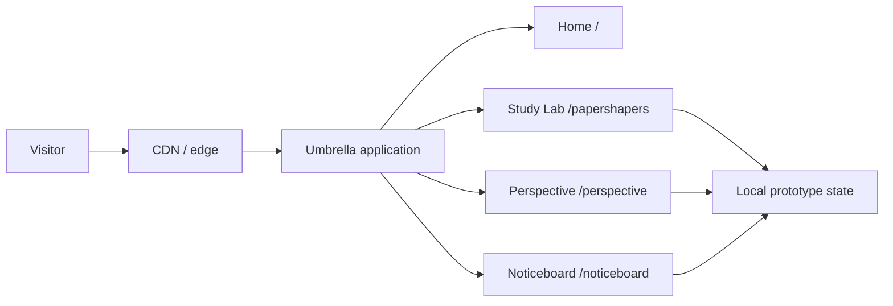
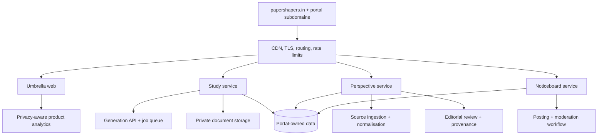

# Paper Shapers system design

## Objective

Build a recognisable umbrella brand that can launch several focused services cheaply, validate them independently, and extract successful products into subdomains or separate deployments without a front-end rewrite.

## Current system (phase 1)

The current application is a single vinext deployment. Pages render on the server; only the menu, study brief, lens switcher, and board filter hydrate in the browser. This provides a realistic product prototype with a small operational footprint and no database cost.

## Target system (phases 2–3)

Suggested domain map:

| Surface | Phase 1 | Future subdomain |
| --- | --- | --- |
| Umbrella | `/` | `papershapers.in` |
| Study Lab | `/papershapers` | `learn.papershapers.in` |
| Perspective | `/perspective` | `perspective.papershapers.in` |
| Noticeboard | `/noticeboard` | `nearby.papershapers.in` |

During validation, subdomains can redirect to routes. Extraction should happen only when a portal needs a distinct backend, security boundary, team, or release cadence.

## Portal boundaries

- **Study Lab:** curricula, practice configuration, uploads, generation jobs, answer keys, saved work.
- **Perspective:** sources, claims, viewpoint analysis, editorial decisions, corrections, publication history.
- **Noticeboard:** places, geographic cells, posts, expiry, verification, reports, moderation.
- **Umbrella:** discovery, shared brand, cross-navigation, legal pages, and aggregate status only.

Each portal owns its data. The umbrella may consume a small public catalogue API later, but it must not query portal tables directly.

## Key backend flows

### Study generation

1. Validate curriculum, class, chapter, intent, and limits.
2. Create an idempotent generation job; do not keep a request open for model work.
3. Retrieve approved curriculum context and, when authorised, user documents.
4. Generate structured questions and answers, then validate schema and safety.
5. Persist the result and notify the client by polling or server events.
6. Expire private uploads on a documented schedule.

### Perspective publishing

1. Ingest licensed feeds and primary sources; preserve canonical URLs and timestamps.
2. Cluster reporting about the same event.
3. Extract claims separately from commentary.
4. Produce viewpoint drafts with source-level citations and uncertainty markers.
5. Require human editorial approval for publication and corrections.
6. Publish a versioned article; never silently rewrite an earlier analysis.

### Noticeboard posting

1. Establish approximate area with explicit visitor choice; precise location is optional.
2. Verify business contact or community identity before high-volume posting.
3. Store a structured post with category, area, start/end time, and expiry.
4. Run automated risk checks, then route reports and uncertain cases to moderation.
5. Rank primarily by distance, freshness, and relevance—not paid engagement.

## Security and trust controls

- Rate-limit generation, authentication, publishing, and reporting separately.
- Use short-lived signed upload URLs; scan documents before processing.
- Isolate uploaded content from prompts and treat it as untrusted data.
- Keep immutable provenance for news sources and editorial changes.
- Minimise location precision and never expose a private user's exact coordinates.
- Expire noticeboard posts by default and record moderation actions.
- Add consent-aware analytics; avoid cross-portal behavioural profiles.
- Store secrets only in the hosting platform, never in client bundles or the repository.

## Deployment strategy

The repository is compatible with the bundled Sites/Cloudflare workflow. A conventional Netlify deployment is also possible after providing a compatible adapter for the vinext output. For the lowest-risk launch, use the included deployment target; it requires no database for phase 1 and can add edge persistence later.

Recommended rollout:

1. Ship this public prototype and collect task-level feedback.
2. Connect one vertical slice per portal, beginning with study brief generation.
3. Add portal-specific persistence only when the vertical slice proves useful.
4. Introduce subdomain aliases, then separate deployments when operational needs diverge.

## Quality gates

- Production build and structural tests pass.
- No starter metadata or prototype-only dependencies remain.
- Critical interactions work with keyboard and touch.
- Layout is reviewed at approximately 390 px, 768 px, and 1440 px.
- Demo content is visibly described as illustrative.
- The relevant README and this design document reflect every architecture change.
