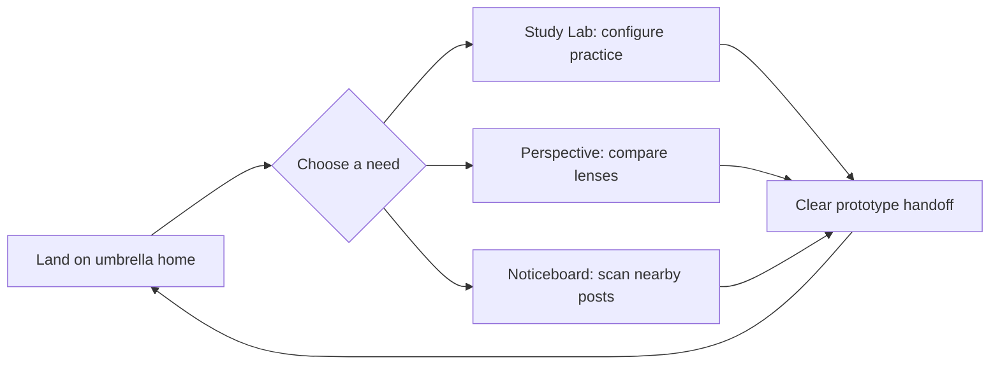
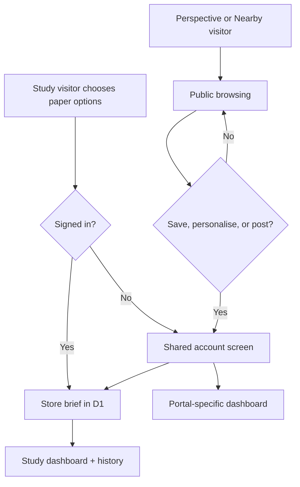

# Paper Shapers UI/UX guide

## Experience model

The umbrella should feel like one house with three independent rooms. Shared chrome creates recognition; product-specific colour, language, density, and interaction carry the energy of each portal.

## Shared baseline

- Use the same header, product switcher, spacing rhythm, typography scale, focus treatment, and footer logic.
- Keep primary navigation URLs stable; portals do not communicate through hidden client state.
- Start each page with a plain-language promise and a visible next action.
- Pair colour with labels and structure. Never make colour the only explanation.
- Prefer native links, buttons, and form controls; keyboard and touch are first-class inputs.
- Label illustrative content and incomplete backend actions at the point of use.

## Portal energy

| Portal | User mindset | Visual/interaction character | Primary flow |
| --- | --- | --- | --- |
| Study Lab | Focused, task-oriented | Structured sheets, deliberate controls, academic clarity | Choose context → shape a study brief → review sample/handoff |
| Perspective | Careful, analytical | Editorial pacing, visible labels, restrained comparison | Read fact base → switch lens → inspect framing/questions |
| Noticeboard | Fast, local, time-sensitive | Tactile cards, energetic categories, scannable details | Confirm area → filter category → inspect a fresh post |

These are now implemented as separate visual systems rather than colour variants:

- **Study:** navy/gold academic workbench, graph-paper surfaces, exam-sheet objects, deliberate progress/history tables.
- **Perspective:** newspaper masthead, edition rules, long-form serif rhythm, restrained red editorial accents, no infinite feed.
- **Nearby:** warm location-led marketplace, cheerful tickets, rounded controls, short scannable cards, explicit area context.

## Account journeys

The account screen is shared because identity is shared. The destination after sign-in is portal-specific. Perspective and Nearby prompts are delayed, dismissible, and never cover the core reading/browsing experience permanently.

## Dashboard principles

- Study history is operational: every real brief is stored, dated, and distinguished from seeded samples.
- Perspective preferences affect topic ordering only; all political/editorial lenses remain available.
- Nearby cold start uses explicit interests and a coarse area rather than precise location or inferred sensitive traits.
- Seed data carries a visible `SAMPLE` label and is not counted as real user achievement.
- Dashboard controls write to D1 and provide an immediate saved/error state.

## Responsive workflow

### Mobile (~390 px)

- Collapse navigation behind a labelled button with an accurate expanded state.
- Stack hero content and portal controls in reading order.
- Keep interactive targets comfortable for touch and avoid horizontal scrolling.

### Tablet (~768 px)

- Preserve clear portal identity while allowing two-column arrangements where content remains readable.
- Keep filters and lens controls close to the content they affect.

### Desktop (~1440 px)

- Limit reading width; use extra space for hierarchy rather than oversized paragraphs.
- Allow richer card grids without weakening the primary journey.

## Change review checklist

1. Can a new visitor identify the portal and its purpose without relying on the header?
2. Is the next action obvious and keyboard reachable?
3. Does changing a control visibly update only the expected content?
4. Is demonstration data clearly labelled?
5. Does the page retain its own product voice while still belonging to Paper Shapers?
6. Does the experience remain coherent at mobile, tablet, and desktop widths?
7. Were the portal README, system design, and changelog updated when relevant?
